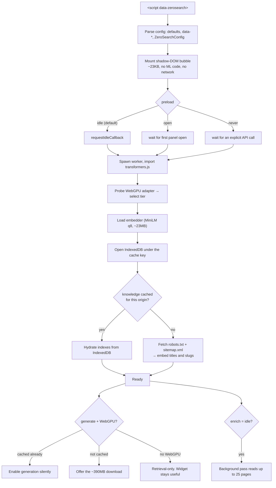
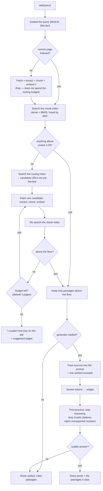

# zerosearch

**AI site search with zero backend.**

An AI assistant for your site, in one `<script>` tag. It reads the site, indexes it, retrieves
from it and answers questions about it — **entirely in the visitor's browser**. No server to run,
no API keys, no per-query bill, no data leaving the origin.

```html
<script src="https://your-site.example/zerosearch.js" data-zerosearch defer></script>
```

That is the whole integration. The script mounts a shadow-DOM widget, discovers the site's
pages from `sitemap.xml`, and starts answering with cited passages from real pages. On a device
with WebGPU it can additionally write a short prose answer over those passages.

**▶ [Try the live demo](https://searpro.github.io/zerosearch/)** — a 13-page fictional product site
with the widget on it. Retrieval starts working within seconds and costs about 36MB; written
answers are offered separately, because they mean a 386MB model download and that should be your
choice, not a surprise.

Everything runs client-side via [transformers.js](https://github.com/huggingface/transformers.js)
v4: embeddings with `all-MiniLM-L6-v2`, generation with `SmolLM2-360M-Instruct`, retrieval with a
hand-rolled hybrid index in IndexedDB.

**Status:** phases 0–3 complete and tested (boot, retrieval, generation, progressive enrichment).
Actions/tool-calling and the prebuilt-index CLI are not built yet — see
[Project status](#project-status).

---

## Contents

- [Why it is built this way](#why-it-is-built-this-way)
- [Installation](#installation)
- [Configuration](#configuration)
- [Architecture](#architecture)
- [Process flow](#process-flow)
- [Embedding and retrieval](#embedding-and-retrieval)
- [Runtime tiers](#runtime-tiers)
- [Generation and grounding](#generation-and-grounding)
- [Progressive enrichment](#progressive-enrichment)
- [Caching and freshness](#caching-and-freshness)
- [Privacy](#privacy)
- [Content-Security-Policy and self-hosting](#content-security-policy-and-self-hosting)
- [JavaScript API](#javascript-api)
- [Development](#development)
- [Project status](#project-status)
- [Known limitations](#known-limitations)
- [License](#license)

---

## Why it is built this way

Three constraints shape every decision in this codebase. They are worth stating up front, because
most of what looks unusual here follows directly from them.

1. **Model weight dominates cost.** Weights are cached per browser, per device. Nothing is shared
   between visitors, so a generative tier is a ~390MB download for *every* new visitor.
2. **WebGPU or bust for generation.** Roughly 20–40 tok/s with WebGPU; 2–5 tok/s on WASM, which is
   not a chat experience. Devices without WebGPU get retrieval-only answers rather than a slow
   version of the real thing.
3. **Every cold visitor pays the build cost.** `Cache Storage` and IndexedDB are per-origin and
   per-browser. N concurrent cold visitors means N× crawl traffic against the origin.

Hence: lazy sitemap-driven crawling instead of an upfront full crawl, a bounded and idle-scheduled
background pass instead of an unbounded one, a tier system with a default ceiling that does *not*
include the big download, and strict grounding with a refusal floor instead of free-form chat.

---

## Installation

### Script tag (the drop-in path)

Build the bundles, copy `dist/zerosearch.js` and `dist/zerosearch.worker.js` to the same directory on your
site, and add one tag:

```html
<script src="/assets/zerosearch.js" data-zerosearch defer></script>
```

`data-zerosearch` is the opt-in marker: the script auto-boots only when it is present, and the worker
URL is derived from the script's own `src` (override with `data-worker-url` if they live apart).

Requirements on the host site:

- A reachable `sitemap.xml` (override the path with `data-sitemap`). Without one, the assistant
  falls back to a same-origin link crawl of the current page.
- A `robots.txt` that does not `Disallow` the pages you want indexed — the crawler honours it.

### npm

```bash
npm install zerosearch
```

```js
import ZeroSearch from 'zerosearch';

await ZeroSearch.boot({ sitemapUrl: '/sitemap.xml', widget: false });
const result = await ZeroSearch.ask('what is in the Team plan?');
```

Importing the module gives you the API without mounting anything: the auto-boot only fires when a
`script[data-zerosearch]` tag exists on the page. Named exports (`ZeroSearch`, `Widget`, `Orchestrator`,
`resolveConfig`, `DEFAULT_CONFIG`, and all types) are available from the same entry.

### Build outputs

`npm run build` produces three files in `dist/`:

| File | Format | Role |
|---|---|---|
| `zerosearch.js` | IIFE | The script tag build. Config, events, widget shell, DOM extraction. **23.2KB brotli**, against a 30KB budget enforced in `npm run size`. |
| `zerosearch.mjs` | ESM | The npm build. Same code, keeps named exports, installs no global. |
| `zerosearch.worker.js` | ESM | The worker: capabilities, embedder, generator, indexing, retrieval. **14.7KB brotli**, fetched lazily, once per browser. |

The main bundle contains no ML code at all. That is the point: a page that embeds the script but
is never interacted with pays roughly 23KB and nothing else.

---

## Configuration

Set options as `data-*` attributes on the script tag:

```html
<script
  src="/assets/zerosearch.js"
  data-zerosearch
  data-sitemap="/sitemap.xml"
  data-max-tier="small"
  data-generate="ask"
  data-enrich="idle"
  data-enrich-pages="25"
  data-accent="#0f766e"
  defer
></script>
```

| Attribute | Default | Meaning |
|---|---|---|
| `data-sitemap` | `/sitemap.xml` | Where the URL manifest lives. Resolved against the document base URL. |
| `data-max-tier` | `small` | Ceiling on the runtime tier: `retrieval`, `small`, `standard`. |
| `data-generate` | `ask` | `ask` offers the model download, `auto` starts it immediately, `never` disables generation. |
| `data-enrich` | `idle` | `idle` reads the site ahead in the background; `never` turns that off. |
| `data-enrich-pages` | `25` | Cap on pages the background pass may fetch, per visitor. `0` disables it. |
| `data-max-pages` | `500` | Cap on sitemap URLs entering the routing manifest (1–5000). |
| `data-preload` | `idle` | When to start the engine: `idle`, `open` (first panel open), `never`. |
| `data-model-base-url` | HF CDN | Base URL for model weights, if you self-host them. |
| `data-library-url` | pinned jsDelivr | Where to load transformers.js from. Set this under a strict CSP. |
| `data-worker-url` | next to the script | Override when the worker is served from a different path. |
| `data-version` | none | Hard cache-buster. Bump on deploy to discard all stored knowledge for the origin. |
| `data-widget` | `true` | `false` gives a headless engine with no UI. |
| `data-position` | `bottom-right` | Or `bottom-left`. |
| `data-theme` | `auto` | `auto`, `light`, `dark`. |
| `data-accent` | `#4f46e5` | Accent colour for the widget. |
| `data-debug` | `false` | Log config, warnings and engine chatter to the console. |
| `data-index` | none | *Reserved.* A prebuilt static index is Phase 5 and not yet consumed. |

Config never throws. A bad value falls back to its default and is recorded as a warning (printed
only when `data-debug` is on) — a widget must not break the page it is embedded on.

### `window.ZeroSearchConfig`

When the script tag is written by a CMS or a tag manager and cannot carry attributes, set the
config on the page instead. It must appear **before** the script:

```html
<script>
  window.ZeroSearchConfig = { sitemapUrl: '/sitemap.xml', maxTier: 'retrieval', accent: '#0f766e' };
</script>
<script src="/assets/zerosearch.js" data-zerosearch defer></script>
```

Precedence, least specific first: defaults → `data-*` attributes → `window.ZeroSearchConfig` →
the object passed to `ZeroSearch.boot()`.

---

## Architecture

### The thread split

The single most consequential structural decision: **workers have no DOM.** `DOMParser`,
`document` and `createHTMLDocument` do not exist in worker scope, so Readability cannot run there.
Fetching, HTML extraction and sitemap parsing therefore run on the **main thread**, idle-scheduled;
the worker drives the schedule by *requesting* pages and receives extracted text back.

This turns out to be the faster arrangement anyway — the browser's native HTML parser beats any JS
parser we could bundle, and a `DOMParser` document has no browsing context, so scripts do not run
and subresources are not fetched. `tsconfig.worker.json` drops the DOM lib, so a regression here is
a compile error rather than a runtime surprise.

```
┌─────────────────────── MAIN THREAD ────────────────────────┐
│                                                            │
│  index.ts        window.ZeroSearch, auto-boot, event wiring     │
│  config.ts       data-* parsing, defaults, validation      │
│  ui/             shadow-DOM widget (bubble, panel, render) │
│  engine/                                                   │
│    orchestrator  owns the worker, republishes events       │
│    host          answers the worker's DOM callbacks        │
│    rpc           typed request/response + streaming        │
│    events        typed event bus (powers onEvent)          │
│  dom/                                                      │
│    fetcher       polite queue, robots, conditional GET     │
│    extract       DOMParser + Readability + JSON-LD/OG      │
│    manifest      sitemap.xml / sitemapindex parsing        │
│    idle          requestIdleCallback + Safari fallback     │
│                                                            │
└───────────────────────────┬────────────────────────────────┘
                            │  postMessage RPC — both directions
┌───────────────────────────┴──── WEB WORKER ────────────────┐
│                                                            │
│  worker/                                                   │
│    worker        entry, RPC dispatch                       │
│    engine        indexing, routing, retrieval, answering   │
│    capabilities  WebGPU probe, adapter limits, tier choice │
│    embedder      feature-extraction, mean pool, L2 norm    │
│    generator     text-generation, chat template, streaming │
│    library       runtime import of transformers.js         │
│  knowledge/                                                │
│    chunk         heading-aware chunking with overlap       │
│    store         IndexedDB: meta, manifest, pages,         │
│                  chunks, vectors                           │
│    vector        flat Float32Array matrix + top-k cosine   │
│    bm25          lexical index                             │
│    fuse          reciprocal rank fusion                    │
│    hybrid        dense + lexical behind one interface      │
│    enrich        extractive page summary → routing text    │
│    categories    category tree + suggested questions       │
│    urls, hash, robots, tokenize                            │
│  chat/                                                     │
│    prompt        system prompt, context packing, citations │
│    answer        post-processing, refusal, number check    │
│                                                            │
└────────────────────────────────────────────────────────────┘
```

The RPC runs **both ways**. The main thread calls `worker:init`, `worker:ask`, `worker:backfill`,
`worker:topics`, `worker:revalidate`. The worker calls back with `host:fetchPage` and
`host:manifest`, because it cannot do either itself. Notifications (`evt:token`,
`evt:indexProgress`, `evt:enrichDone`, …) are fire-and-forget from worker to main thread, and land
on the public event bus.

### Two indexes, two granularities

The same `HybridIndex` class is used twice, for two different jobs:

- **The routing index**, over the sitemap manifest — one entry per URL. It decides *which page is
  worth fetching at all.* Built cheaply upfront from titles and URL slugs, then upgraded with real
  page content as pages get read.
- **The chunk index**, over passages of fetched pages. It finds the actual text that answers a
  question.

Routing is what makes lazy crawling viable: hundreds of URLs at ~10 tokens each is seconds of work
and zero page fetches, and it is enough to pick the two or three pages worth fetching for a
specific question.

---

## Process flow

### Boot, staged

The script tag must not add hundreds of KB to a page load, so boot happens in three stages, each
gated on something more specific than the last.



1. **Immediate (~23KB):** parse config, mount the bubble. No ML code loaded, no requests made.
2. **On idle, or on first panel open:** dynamic-import transformers.js, load the embedder, build
   the routing manifest from `sitemap.xml`, index the current page. Opening the panel is the
   clearest signal of intent there is, so it always starts the engine regardless of `data-preload`.
3. **On first question needing generation:** download the generator model, behind an explicit
   progress UI and an explicit opt-in.

### Answering a question



Two details in there are load-bearing and were arrived at by measurement:

- **Re-check after every fetched page, not after the batch.** Before a page has been fetched,
  routing has only its URL slug to go on, so the right page is often not the first guess. Stopping
  at the first miss loses answers that were two places further down; checking each time also means
  a lucky first guess returns immediately.
- **Filter per passage, not per query.** Once one passage clears the floor it would be easy to
  return the whole result set — but then a citation scoring 0.09 is displayed next to one scoring
  0.64 as though both supported the answer.

---

## Embedding and retrieval

### The embedder

| | |
|---|---|
| Model | `Xenova/all-MiniLM-L6-v2` |
| Quantisation | `q8` — about 23MB |
| Dimensions | 384 (read from the model at load time, not assumed) |
| Pooling | Mean, then L2-normalised, so a dot product *is* cosine similarity |
| Max input | 256 word-piece tokens; input is truncated at 2000 characters |
| Batching | 16 at a time, yielding between batches so the worker stays responsive to a cancel |

The embedder sits behind an interface rather than being called directly, so a multilingual model
can be swapped in by configuration and so no test ever downloads a model. Its id
(`model@dtype`) is part of the cache key: swapping the embedder invalidates every stored vector,
because vectors from two different models are not comparable.

### Chunking

Heading-aware, with overlap:

| Setting | Value | Why |
|---|---|---|
| Target size | 700 chars | Comfortably inside the model's 256-token window |
| Hard ceiling | 900 chars | Past this MiniLM silently truncates and the chunk loses its tail |
| Overlap | 120 chars | An answer spanning a boundary stays retrievable |
| Minimum | 90 chars | Below this a trailing fragment merges backwards rather than standing alone |

Each chunk is prefixed with the page title and its heading path (`Pricing — Acme › Plans › Team`).
That costs a few tokens and earns them back twice: the embedding captures where the text sits in
the document, and a retrieved chunk is self-describing when shown as a citation. Fragments only
ever merge *within* one section — splicing two sibling sections together would leave a chunk
carrying a heading path it does not match, and that path is what the reader sees.

### Hybrid search

Dense-only retrieval over a 23MB MiniLM misses exact terms — SKUs, version numbers, error codes,
product names. So every search runs both retrievers and fuses them:

- **Dense:** flat `Float32Array` matrix, brute-force top-k dot product. No ANN library — 5,000
  chunks × 384 dims is a 7.7MB array and about 5ms per query. HNSW would be complexity for nothing.
- **Lexical:** BM25 (`k1 = 1.2`, `b = 0.75`) over a tokenized index.
- **Fusion:** Reciprocal Rank Fusion, equal weights by default.

RRF is used because it is *rank*-based. The two scores are not on a common scale and cannot be
compared numerically, but their orderings can be combined without either dominating.

### The relevance floor

**Grounding gates on cosine similarity only — never on the fused score, never on BM25.**

```
RELEVANCE_FLOOR = 0.28
```

A genuinely relevant MiniLM chunk lands around 0.4–0.7; unrelated text sits near zero. The fused
RRF score is only comparable within one result set, and BM25 *sums over query terms*, so a longer
question accumulates score from several mediocre matches. Measured on the demo corpus, letting an
absolute lexical threshold also count as grounding admitted citations at cosine **0.02** and
dropped the golden set from 8/12 to 5/12.

Lexical retrieval still earns its place in *ranking* through fusion, which is immune to this. It
just does not get a vote on whether we are allowed to answer.

Below the floor, the assistant does not return the least-bad passage. It says it could not find
the answer and offers pages that might be relevant instead. A confident wrong citation is worse
than an admission.

---

## Runtime tiers

Selected at boot from the WebGPU adapter's own reported limits, and never exceeding the site's
ceiling (`data-max-tier`, default `small`).

| Tier | Selected when | Embedder | Generator | First load |
|---|---|---|---|---|
| `retrieval` | No WebGPU, or `saveData`, or a 2G connection, or adapter limits too small | MiniLM-L6-v2 q8 | none | **~36MB** |
| `small` (default) | WebGPU + `maxBufferSize` ≥ 256MB + `maxStorageBufferBindingSize` ≥ 128MB | same | SmolLM2-360M-Instruct q4 | **~410MB** |
| `standard` | WebGPU + `maxBufferSize` ≥ 1GB + explicit opt-in | same | same as `small`, for now | — |

`navigator.deviceMemory` and `navigator.connection` are Chromium-only. They are used as hints that
can only ever *downgrade* a decision, never as gates — treating either as a requirement would
silently push every Safari and Firefox visitor into the wrong tier. Unknown adapter limits are
likewise not treated as small: some adapters simply do not report them, and refusing on absence
would exclude working devices.

Everything degrades toward `retrieval`, which works everywhere. A wrong guess in that direction
costs answer quality; a wrong guess in the other direction costs a visitor a ~390MB download their
device cannot actually run.

---

## Generation and grounding

Generation is **opt-in and additive**. The retrieved passages are always shown, so a wrong summary
is checkable against its own sources.

### The model

| Model | dtype | Result |
|---|---|---|
| SmolLM2-360M | `q4` | **8/11 on the scored golden set — shipped** |
| SmolLM2-360M | `q4f16` | Empty assistant turn, every time, no error |
| Qwen3-0.6B | `q4` | Fails to allocate a session (`std::bad_alloc`) |
| Qwen3-0.6B | `q4f16` | 1/11, echoes the prompt's worked example back |

Two things worth knowing before changing this. `q4f16` is broken for both models on this stack —
silently, which is the expensive kind of broken. And the larger model was *worse*, not better: at
0.6B it neither fits at `q4` nor follows the prompt at `q4f16`. "Use a bigger model" is not an
available fix here. Both tiers therefore load the one configuration measured to work; `standard`
exists so a validated larger model can drop in later without touching anything else.

### The prompt

Four short imperative lines, plus **one worked example** prepended to every request.

The worked example is the single highest-leverage thing in the prompt. With instructions alone,
SmolLM2-360M returned the refusal sentinel for questions the sources plainly answered — a small
model reaches for the escape hatch rather than judging whether the sources are sufficient. One
demonstration of the expected shape makes answering the default and fixes the citation format at
the same time. The refusal rule is phrased as a narrow exception and placed last, so it reads as
the unusual case rather than the salient one.

Refusal is a fixed sentinel (`NOT_FOUND`), not a phrase. Asking a small model to "say you don't
know" produces a different wording every time, none of which can be detected reliably; a fixed
token can be, and the UI renders the real refusal itself.

### Post-processing

Every generated answer passes three gates before it is shown:

1. **Reasoning stripped.** `<think>` blocks, including unterminated ones left behind when
   generation hits the token limit.
2. **Citation markers validated.** `[3]` pointing at a source that does not exist is removed, not
   rendered.
3. **Unsupported numbers rejected.** If the answer states a figure that appears nowhere in its
   sources, the whole answer is discarded and the passages are shown instead.

That third check exists because of a measured failure: asked how many people work at the company,
with a source reading "We are 34 people", the model answered *"We are 19 people [2]"* — fluent,
correctly formatted, correctly cited, and wrong. The check is deliberately one-directional: every
number in a faithful answer came from its sources, so it can never reject a correct answer.

---

## Progressive enrichment

Lazy routing has a hole, and it is worth naming precisely: until a page has been fetched, routing
knows only its URL slug. So `faq.html` and `about.html` are invisible to a question about
migration or headcount, because the two words in those URLs say nothing about either. Retrieval
was never the weak part — it scores 0.43–0.80 on the correct passage — the page simply never got
fetched.

The background pass closes that by reading pages ahead of being asked. Measured on the same golden
set the retrieval phase was measured against:

| | Routing hit rate |
|---|---|
| Cold, just-in-time only | 10/12 |
| After the background pass | **12/12** |

Both previously-unreachable questions are reached, every enriched answer costs zero fetches at the
moment of asking, and the refusals still refuse.

**The summary is extractive, not generated** — headings and lead sentences, in the page's own
words. This is a deliberate departure from the original plan. A summary is *persisted* and decides
which pages later questions reach, so a hallucinated one poisons routing for the life of the cache
— and this model states figures its sources contradict in 2 of 11 answers. It is also unavailable
to most visitors: generation needs WebGPU and a download the visitor has to accept, whereas routing
has to work on the first visit and on every device. Extraction costs nothing, works everywhere, and
cannot say anything the page does not.

**The cost is real and is bounded five ways**, because there is no shared index and an uncapped
pass would multiply one page view into a full crawl:

- `data-enrich-pages` caps it at 25 pages per visitor.
- Every fetch waits for `requestIdleCallback` first.
- A `navigator.locks` lease keyed on the origin means only one tab crawls, however many are open.
- The pass stands aside entirely while a question is in flight.
- `data-enrich="never"` turns it off.

**Resumability needed almost no machinery.** Which pages are indexed is already recorded, one
transactional write at a time, by the `pages` store — that *is* the resume point, and deriving it
from the real data cannot drift the way a separate cursor would. The only thing needing its own
record is the set of URLs tried and found unusable, without which every visit re-spends budget on
the same 404s.

### "What can I ask?"

The same manifest produces a category tree, derived from **URL path hierarchy, breadcrumbs and
titles** rather than from model output — more accurate than a 0.6B model's guesses, and free. It
fills the empty panel on first open with suggested questions drawn from the site's own headings,
and sharpens as the background pass runs.

---

## Caching and freshness

Everything is persisted to IndexedDB (`zerosearch`, five object stores: `meta`, `manifest`, `pages`,
`chunks`, `vectors`) under a compound cache key:

```
s1 | https://example.com | Xenova/all-MiniLM-L6-v2@q8 | c1 | x1 | e1 | <data-version>
  ^        ^                          ^                 ^    ^    ^         ^
schema   origin                  embedder id       chunker │  enrichment  site
                                                       extractor          version
```

Any component changing discards the stored knowledge for that origin, because old data and new
queries would otherwise be operating under different assumptions. `data-version` is the manual
lever: bump it on deploy to force a rebuild.

Freshness is handled by **conditional GET plus content hash**. `revalidate()` re-requests indexed
pages with their stored `ETag` / `Last-Modified`; a 304 costs nothing, a 404 drops the page, and a
200 is compared by content hash before anything is re-embedded — a server can return 200 with
identical bytes, and re-embedding an unchanged page is pure waste.

Because crawling is lazy, only the handful of pages actually indexed need revalidating. The most
accurate freshness strategy is also the cheapest one here.

---

## Privacy

Zero egress beyond model weights and the site's own pages. Specifically:

- **Crawl requests go out with `credentials: 'omit'`.** A logged-in visitor's personalised pages
  must never reach the index — it is persisted to IndexedDB and shown to whoever uses the browser
  next.
- **Same-origin only**, HTML only, with a 2MB ceiling per response, so a single pathological URL
  cannot exhaust memory.
- **`robots.txt` is honoured**, including `*` wildcards and `$` end anchors.
- **No questions, answers or page content leave the browser.** There is no server to send them to.
- **Inert parsing:** extraction uses a `DOMParser` document with no browsing context, so scripts
  in crawled pages do not run and their subresources are not fetched.
- **URLs are canonicalised** before indexing — a declared `<link rel="canonical">` wins, otherwise
  the fragment is dropped — so a visitor arriving with `?utm_source=…` does not create a duplicate
  copy of the page in the index.

Politeness matters too, since every cold visitor is effectively a crawler hitting the origin:
concurrency is capped at 2, requests are spaced 150ms apart, each one waits for an idle moment
first, and a cross-tab `navigator.locks` lease keeps four open tabs from sending four crawls.

---

## Content-Security-Policy and self-hosting

transformers.js is loaded at runtime from a pinned CDN specifier rather than bundled. This is not a
preference: Vite's library mode has no chunks to put the ONNX runtime's `.wasm` binaries in, so
bundling base64-inlined them and produced a **63MB worker** for a 2MB library. Loaded at runtime,
the runtime fetches its wasm normally, only when it actually needs it.

Default: `https://cdn.jsdelivr.net/npm/@huggingface/transformers@4.2.0/+esm`. The `+esm` endpoint
matters — the raw `dist/` file ships bare specifiers a browser cannot resolve without an import
map. The version is pinned so a dependency cannot change under a site that has not redeployed.

Under a strict CSP you will need roughly:

```
script-src  'self' https://cdn.jsdelivr.net 'wasm-unsafe-eval';
connect-src 'self' https://cdn.jsdelivr.net https://huggingface.co https://cdn-lfs.huggingface.co;
worker-src  'self' blob:;
```

To avoid third-party origins entirely, host both yourself:

```html
<script
  src="/assets/zerosearch.js"
  data-zerosearch
  data-library-url="/assets/transformers.mjs"
  data-model-base-url="/models/"
  defer
></script>
```

A failure to load the library is reported with an actionable message naming the CSP requirement,
rather than hanging silently.

---

## JavaScript API

The script tag installs `window.ZeroSearch`. The npm build exports the same instance as its default
export.

### Methods

```ts
// Lifecycle
await ZeroSearch.boot(overrides?)            // resolve config + mount widget. Cheap: no worker, no network
await ZeroSearch.prepare()                   // start the worker, load the embedder, build the manifest
ZeroSearch.destroy()                         // tear down worker, widget and listeners

// Asking
const result = await ZeroSearch.ask('what is in the Team plan?')
// -> { grounded, citations[], suggestions[], fetched[], tookMs, answer, sources[], cited[] }

// Reading the site ahead
await ZeroSearch.enrich({ budget: 25 })      // bounded, idle-scheduled, resumable
await ZeroSearch.cancelEnrichment()          // what has been read is kept

// Introspection
await ZeroSearch.topics(limit?)              // category tree + suggested questions
await ZeroSearch.stats()                     // { pages, chunks, manifestSize, embedderId, tier }
await ZeroSearch.generationStatus()          // { available, enabled, cached, modelLabel, approxBytes, reason }
await ZeroSearch.enableGeneration()          // the ~390MB download, explicitly
await ZeroSearch.revalidate()                // re-check indexed pages, re-index what changed

// Widget
ZeroSearch.open(); ZeroSearch.close(); ZeroSearch.toggle()
```

`ask()` and `prepare()` boot the engine on demand, so a headless integration never has to sequence
anything by hand. `enrich()` does what it says regardless of `data-enrich` — that attribute
governs whether the pass starts *on its own*; a call from the site's own code is more specific than
a default the site set once.

### Events

```js
ZeroSearch.on('index:done', ({ pages, chunks, fromCache }) => { /* … */ });

// Or subscribe to everything — this is the hook for piping into your own analytics
ZeroSearch.onEvent((event) => console.log(event.type, event.payload));
```

| Event | Payload |
|---|---|
| `ready` | `{ tier }` |
| `tier` | `{ tier, reason, capped }` |
| `index:start` | `{ source: 'prebuilt' \| 'crawl' \| 'backfill', urls }` |
| `index:progress` | `{ done, total, url? }` |
| `index:done` | `{ pages, chunks, fromCache }` |
| `enrich:progress` | `{ done, total, url? }` |
| `enrich:done` | `{ indexed, skipped, remaining, completed, cancelled, pages }` |
| `model:progress` | `{ name, loaded, total }` |
| `generation:ready` | `{ modelLabel }` |
| `answer:token` | `{ requestId, text }` |
| `open` / `close` | `{}` |
| `error` | `{ scope, message, cause? }` |

Every subscription returns an unsubscribe function. A listener that throws is caught and reported
rather than being allowed to break the engine.

---

## Development

```bash
npm install
npm run dev          # demo site at http://localhost:5173/demo/index.html
```

| Script | What it does |
|---|---|
| `npm run dev` | Regenerates the demo site to load TS source, starts Vite |
| `npm run build` | All three bundles + type declarations |
| `npm run typecheck` | `tsc --noEmit` for both the main and worker tsconfigs |
| `npm test` | Vitest unit suite — **341 tests across 19 files** |
| `npm run test:e2e` | Builds, regenerates the demo against `dist/`, runs Playwright |
| `npm run size` | Enforces the 30KB brotli budget on the script-tag bundle |

### The demo site

`demo/` is a deliberately messy 13-page static site (pricing, docs, FAQ, blog, about, changelog,
contact) with a `sitemap.xml` and a `robots.txt`. It is both the development target and the
Playwright fixture. It is generated by `demo/build-demo.mjs` rather than hand-written, so tests can
mutate a page's content and re-emit it — that is how the revalidation path gets exercised.

### Testing

**Unit (Vitest, jsdom):** 341 tests covering chunker boundaries, sitemap and robots parsing, RRF
fusion, cosine top-k, content-hash diffing, config validation, prompt packing, answer
post-processing, tier selection and the engine's routing and fetch-budget logic. No test downloads
a model — the embedder and generator are reached through injectable factories.

**E2E (Playwright):** 33 specs across four files.

| Project | Runs | Why |
|---|---|---|
| `chromium` | boot, retrieval, enrichment | The common case |
| `webkit` | boot, retrieval, enrichment | No WebGPU and none of the Chromium-only capability hints — exactly the environment the retrieval tier must survive |
| `webgpu` | generation only | Playwright's Chromium ships without WebGPU, so this project passes the flags to enable it. Headed, opt-in, and slow |

E2E runs against the **built bundle**, not the dev source. WebKit refuses module workers served as
TypeScript, so testing against source was quietly exercising a path that does not ship.

### Retrieval eval

`eval/queries.json` holds a golden set of 14 questions against the demo site: 12 with expected
source pages, 2 the site does not answer at all — those must be refused, and a run with false
positives fails regardless of hit rate. 11 cases also carry `answerMustContain` /
`answerMustNotContain` substrings for scoring generated prose, where the "must not" list holds
figures that would mean the model read the wrong passage.

The set is run by `tests/e2e/retrieval.spec.ts` and `tests/e2e/generation.spec.ts`, so retrieval
quality is a test failure rather than a vibe.

---

## Project status

| Phase | State |
|---|---|
| 0 — Scaffold, config, widget shell, demo site | ✅ |
| 1 — Retrieval: crawl, extract, chunk, embed, hybrid search, cache | ✅ |
| 2 — Generation: tier-selected model, streaming, grounding, citations | ✅ |
| 3 — Progressive enrichment: background read-ahead, category tree, suggestions | ✅ |
| 4 — Actions and navigation: `registerAction`, intent routing, tool calls | ⬜ Not started |
| 5 — Prebuilt index CLI, CI budgets, npm publish | ⬜ Not started |

Phase 4 is designed to **fail safely**, because sub-1B models are unreliable at function calling:
an embedding-similarity intent router will decide whether a turn is an action *before* the model
sees any tool schema, arguments will go through JSON schema validation with a single repair-retry,
every action will be confirm-before-execute, and any failure degrades to a plain grounded answer
rather than a guess.

Phase 5's `npx zerosearch build` will reuse the same crawl/extract/chunk/embed code paths in Node to
emit a static `zerosearch-index.json`, which boot checks for before crawling anything. `data-index` is
already parsed and validated for it; it is not yet consumed.

---

## Known limitations

**Two of eleven scored answers state a figure their sources contradict.** A Team-plan rate limit
reported as the Business one; an engineering headcount reported as the company's. Both are *real
numbers attached to the wrong claim*, which the unsupported-number check cannot catch by
construction — the number is present in the sources, just not in the source that answers the
question. That count is treated as a test budget that can go down but not up. This is why
generation stays opt-in and the passages are always shown alongside.

The remaining lever, if this needs to be better, is constraining generation to verifiable
extraction: ask for the source sentence that answers the question, copied exactly, and reject any
output that is not a substring of the sources. Prose gets stiffer; faithfulness becomes checkable
rather than hoped for. (Phase 3 already applied that lever where it was cheapest — enrichment
summaries are extractive for exactly this reason.)

**The multi-tab guard covers crawling, not just-in-time fetches.** The manifest build and the
background pass each run under a `navigator.locks` lease keyed on the origin, so four open tabs
send one tab's worth of crawl traffic and the later tabs find the pages already in IndexedDB when
their turn comes. Per-question fetches during `ask()` are deliberately *not* under that lock —
making someone's question queue behind another tab's crawl would cost more than the duplicate
request saves. Browsers without `navigator.locks` fall through to running unguarded.

**English-first.** `all-MiniLM-L6-v2` is an English model. The embedder is behind a swappable
interface and `data-model-base-url` exists, so a multilingual model can be configured in, but
nothing else has been tuned for it.

**Sites without a sitemap get less.** The fallback is a same-origin link crawl of the current page,
which reaches what that page links to and no further.

---

## License

MIT.
